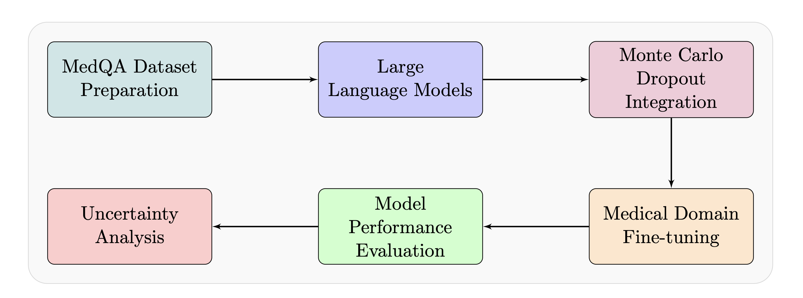
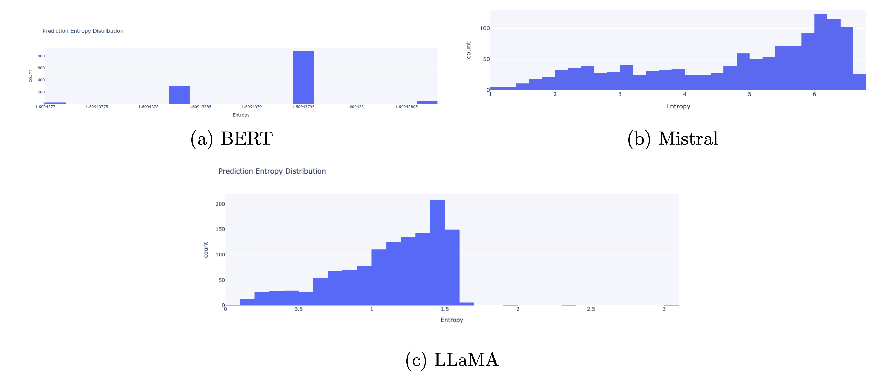

# Bayesian Uncertainty Quantification in Medical Question Answering

<div align="center">
  
  <p><em>Uncertainty-Aware Medical Question Answering System Methodology</em></p>
</div>

## **Overview**

This project integrates **Bayesian Uncertainty Quantification** into **Large Language Models (LLMs)** to create a robust and reliable medical question-answering (QA) system. Using Monte Carlo Dropout for uncertainty estimation, the system ensures higher trustworthiness in predictions—a key need for healthcare AI systems.

### **Key Features**
- 🔍 **Bayesian Uncertainty Estimation**: Provides confidence metrics alongside predictions.
- 🏥 **Medical Domain Expertise**: Fine-tuned models for medical QA.
- 📊 **Multi-Model Comparison**: Evaluation of Llama 8B, Mistral 7B, and BERT.
- 📈 **Entropy & Mutual Information Analysis**: Measures prediction uncertainty.

---

## **Results**

| **Model**        | **Accuracy** | **Average Entropy** | **Mutual Information** |
|------------------|-------------|---------------------|-------------------------|
| **Llama 3.1 8B** | **54%**     | **1.1305**          | **-1.09e-08**           |
| **Mistral 7B**   | 31%         | 4.7910              | -1.17e-08              |
| **BERT**         | 19%         | 1.6094              | 2.36e-08               |

<div align="center">
  
  <p><em>Prediction Entropy Distributions Across Models</em></p>
</div>

---

## **Implementation**

### **Dataset**
- [**MedQA Dataset**:](https://github.com/jind11/MedQA)
  - 10,178 training samples
  - 1,272 test samples
- Format: 5-option multiple-choice questions.

### **Model Architecture**
- **Base Models**:
  - Llama 3.1 8B
  - Mistral 7B
  - BERT
- **Uncertainty Layer**:
  - Monte Carlo Dropout (p = 0.1)
  - 10 stochastic forward passes.

### **Training Configuration**
- Batch size: 8
- Learning rate: 2e-4
- Epochs: 2
- LoRA rank: 16
- Weight decay: 0.01
- GPU: NVIDIA A100 80GB.

---

## **Setup & Usage**

### Clone the repository
```bash
git clone https://github.com/ritik12/BayesianUncertaintyMedicalQA.git
cd BayesianUncertaintyMedicalQA
```

### Install dependencies
```bash
pip install -r requirements.txt
```

### Run notebooks
- Fine-tuning and evaluation scripts are available in the `code/` directory.

### Project Structure
```
.
├── code/
│   ├── Llama/
│   │   ├── MedQA_Llama_eval.ipynb
│   │   └── MedQA_Llama_8B_Fine_tuning.ipynb
│   ├── BERT/
│   │   ├── MedQA_BERT_eval.ipynb
│   │   └── BERT_Fine_tuning.ipynb
│   └── Mistral/
│       ├── MedQA_Mistral_eval.ipynb
│       └── Mistral_7B_Fine_tuning.ipynb
├── assets/
├── data/
└── README.md
```

---

## **Limitations**

The project identified several key limitations:
1. Due to computational constraints, models could only be fine-tuned for 2 epochs, potentially limiting their ability to learn optimal parameters for the medical domain.
2. The absence of validation during training, owing to GPU limitations, prevented monitoring for potential overfitting and optimization of training parameters.
3. The implementation of Monte Carlo Dropout for uncertainty estimation added significant computational overhead during inference.
4. The relatively high entropy values across all models, particularly evident in Mistral’s broad distribution up to 6.0, indicate challenges in achieving confident predictions in specialized medical domains.
5. The trade-off between model size and computational requirements limited the scope of uncertainty analysis techniques that could be implemented.

---

## **Citation**

If you use this work in your research, please cite:

```bibtex
@article{bompilwar2024bayesian,
  title={Bayesian Uncertainty Quantification for Medical Question Answering using Monte Carlo Dropout},
  author={Bompilwar, Ritik and Shah, Harsh and Meher, Easha},
  institution={Northeastern University},
  year={2024}
}
```

---

## **References**

1. Gal, Y., & Ghahramani, Z. (2016). Dropout as a Bayesian Approximation: Representing Model Uncertainty in Deep Learning. *Proceedings of The 33rd International Conference on Machine Learning*. [URL](https://proceedings.mlr.press/v48/gal16.html)

2. Jin, D., Pan, E., Oufattole, N., Weng, W., Fang, H., & Szolovits, P. (2021). What disease does this patient have? A large-scale open domain question answering dataset from medical exams. *Applied Sciences*, 11(14), 6421.

3. Touvron, H., Scherly, E., Shleifer, S., et al. (2023). LLaMA: Open and Efficient Foundation Language Models. *arXiv preprint arXiv:2302.13971*.

4. Mistral 7B Team. (2023). Mistral 7B. *ArXiv*, abs/2310.06825.

5. Wu, J. (2024). Uncertainty Estimation of Large Language Models in Medical Question Answering. *arXiv preprint arXiv:2407.08662*.

6. Devlin, J., Chang, M.-W., Lee, K., & Toutanova, K. (2018). BERT: Pre-training of Deep Bidirectional Transformers for Language Understanding. *arXiv preprint arXiv:1810.04805*.

7. Vaswani, A., et al. (2017). Attention is All You Need. *Advances in Neural Information Processing Systems*, 30.

8. NVIDIA. (2020). NVIDIA A100 Tensor Core GPU Architecture. [URL](https://www.nvidia.com/content/dam/en-zz/Solutions/Data-Center/a100/pdf/nvidia-a100-datasheet.pdf)

9. Hu, E. J., Shen, Y., Wallis, P., et al. (2022). LoRA: Low-Rank Adaptation of Large Language Models. *International Conference on Learning Representations*.

10. Paszke, A., Gross, S., Massa, F., et al. (2019). PyTorch: An Imperative Style, High-Performance Deep Learning Library. *Advances in Neural Information Processing Systems*, 32.

---
